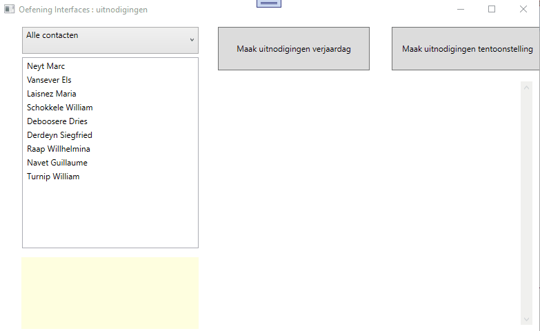

# Oefening klassen/interfaces : uitnodigingen

### Demo  

  

### De bedoeling  

We houden de gegevens bij van personen.  Deze zijn gegroepeerd (geklassificeerd) als familie, vrienden of klanten.  

Van een persoon houden we volgende zaken bij :  naam, voornaam, adres, gemeente en geslacht (voor geslacht maak je een enumeratie aan).  
Familie erft over van persoon en heeft de bijkomende eigenschap "titel" (= oom, tante, oma ...).  
Vriend erft over van persoon (geen bijkomende eigenschappen).  
Klant erft over van persoon en heeft als bijkomende eigenschap "taal" (= nederlands, frans, engels).  

De 3 afgeleide klassen overschrijven elk op hun manier de ToString() methode : let in het filmpje even op het tekstblok onderaan hoe een geselecteerde persoon wordt afgebeeld.  

Er bestaan ook 2 interfaces : IBirthdayInvitation en IBusinessInvitations.  Beide interfaces implementeren 1 methode met dezelfde naam, te weten MakeInvitation die een string retourneert en een string als argument ontvangt (de tekst die in de uitnodiging dient afgebeeld te worden).

Familie en vriend implemnteert de beide interfaces.  
Klant implenteert enkel de IBusinessInvitation.  

De implemntatie van de interface is in de 3 klassen verschillend : bekijk het filmpje om te zien hoe een invitatie naar een familie, een vriend of een klant wordt opgesteld (rechts in tbkInvitations wanneer op de knoppen btnBirthday of btnExhibition wordt geklikt).  

Voorzie eveneens een service klasse (ik gaf deze de naam Contacts) waarin je wat seeding doet en een List met personen ter beschikking stelt t.b.v. je WPF applicatie.  Voeg van de 3 soorten personen minstens 1 toe zodat je wat kunt experimenteren.

In je WPF vul je de listbox met je contacten.  Het vullen van de contacten gebeurt aan de hand van een filter (cmbFilter) die je tijdens de opstart manueel vult (zie demo voor de verschillende waarden).  

Wanneer je een persoon selecteert in de listbox dan dient zijn info (= tostring) in tbkInfo te verschijnen.  
Wanneer je op btnBirthday klikt dient een uitnodiging aangemaakt te worden voor alle personen die de IBirthayInvitation implementeren en afgebeeld te worden in tbkInvitations (zie demo).  
Wanneer je op btnExhibition klikt dient een uitnodiging gemaakt te worden voor alle personen die de IBusinessInvitation implemnteren en afgebeeld te worden in tbkInvitations (zie demo).
